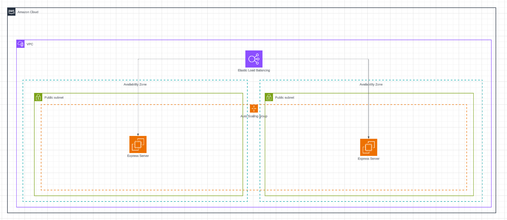

# Highly Available Express App on AWS

## Summary
This project was made to practice using IaC tools and Github Actions to create a highly available Express application in AWS.

## Project Structure
The repo has two main directories
- /app - Contains the Express application we will be deploying
- /infra - Contains all IaC (terraform & shell scripts)

## Infrastructure Diagram

## Express Application
The Express app has two endpoints:
- / - Users can use this endpoint to fetch a simple webpage that will display some welcome text, as well as the hostname of the device it is deployed on.
- /health - Used by AWS target groups to ensure instances are healthy. Will return a 200 response with payload {"status": "ok"} as long as the server is running.

## Infrastructure
The Express application is deployed on AWS via Terraform. The state file is managed remotely in an S3 bucket. In order to ensure high-availability, the following measures have been taken:

### Auto Scaling Group
An Auto Scaling Group has been established so that we always have a minimum of 2 instances up at a time. These instances are split amongst two public subnets in different availability zones, this way if one AZ goes down, the application is still available.

### Application Load Balancer
An Application Load Balancer is deployed to ensure traffic is evenly distributed among all instances of the Express app. The load balancer only allows HTTP requests inbound, and outbound requests to our apps listening port.

### Target Groups
Target groups are setup to enforce constant health checks on our instances using the /health endpoint. If health checks fail, the instance is marked unhealthy and is replaced with a fresh instance by the Auto Scaling Group.

### Instances / Launch Template
Instances are setup using launch templates to ensure consistency. Instances have security rules to only allow inbound traffic from the load balancer, and allow outbound traffic anywhere. Instances use a boot shell script to install dependencies and pull the latest version of the application from Github.

## CI/CD
Github Actions have been used to setup two jobs:

- Plan - When users create a pull request, terraform plan is run to show any potential changes to the infrastructure
- Apply - When changes are merged into the main branch, terraform apply is run to update the infrastructure automatically

Github uses OIDC to authenticate with AWS. I chose to use Terraform to setup the OpenID provider as well as the IAM roles/policies. This can be found under the /infra/bootstrap directory.

## How to Deploy
- Clone the repo via the git CLI
- Use the Terraform CLI to run 'terraform init' and 'terraform apply' within the /infra/bootstrap directory. This will setup the correct IAM roles and OIDC provider for Github actions. Without this, Github actions will not be able to run the terraform commands needed for the application infrastructure.
- There are a few terraform variables that the user can change if needed (see /infra/variables.tf)
- When pushing or merging to main, Github Actions automatically runs 'terraform apply' and updates the infrastructure
- The Load Balancers DNS name is printed as Terraform output. This can be used to access the application.

## Next Steps
- Currently, the application only works via HTTP. We need to utilize HTTPS instead for security.
- No database is being used at the moment. Most modern applications have some kind of database so we should work on adding one. Likely will use a RDS service.
- Currently there are no DNS configurations. We use the auto generated "dns_name" on the load balancer to access the application. We want a human readable name to be used instead. We will use Route53 for this.
